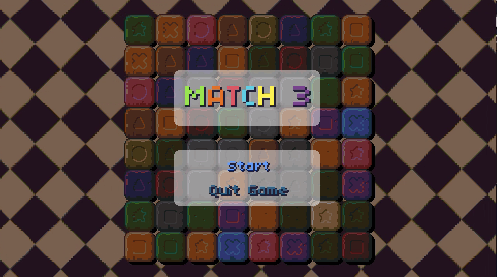
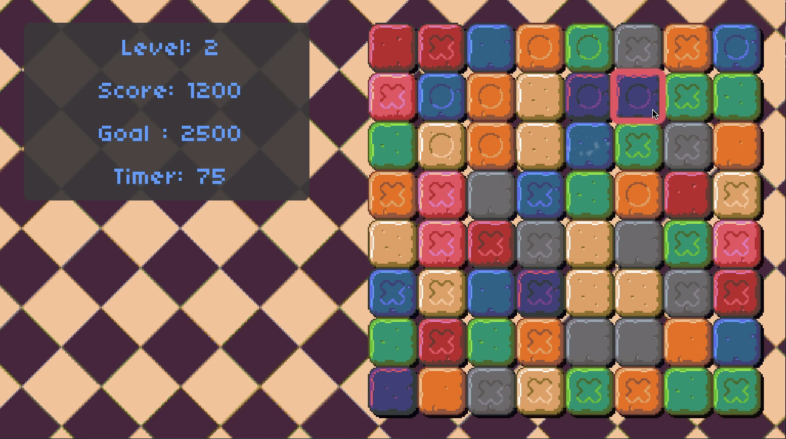

# Breakout

Project 3 of [CS50's Introduction to Games Development](https://cs50.harvard.edu/games/2018/)

Match3 is a [tile-matching game](https://en.wikipedia.org/wiki/Tile-matching_video_game) created in the [LÖVE2D](https://love2d.org/) engine.

[Full project specification](https://cs50.harvard.edu/games/2018/projects/3/match/)

## Setup

First, clone this repository:

```bash
git clone https://github.com/calumbell/cs50g-match3
```

Install LÖVE2D - instructions can be found [here](https://love2d.org/wiki/Getting_Started)

To run the game:

```bash
cd match3
love .
```

## Visuals

You can watch a video demonstration of this project in action [here](https://youtu.be/X_m0xbC8xOE).





## Requirements
Match3 was built using the [LÖVE2D](https://love2d.org/) engine.

[Push](https://github.com/Ulydev/push) was used for resolution-handling, [hump](https://github.com/vrld/hump/blob/master/class.lua) was used for Lua object-orientation, and [Knife](https://github.com/airstruck/knife) was used to handle asynchronous code, chained functions, and tweening.
